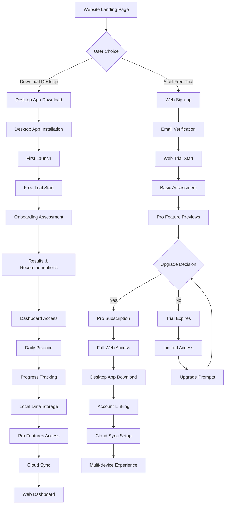

# KeyFlow User Journey Diagram

## Overview

This document provides a visual representation of the complete user journey for KeyFlow, showing the relationship between the desktop app (primary product) and web experience (account management).

## User Journey Flow



## Key Decision Points

### 1. Initial Entry Point
- **Website Landing**: Users discover KeyFlow
- **Choice**: Download desktop app OR start web trial
- **Value Prop**: Desktop for performance, Web for trial

### 2. Desktop App Path
- **Download**: Direct desktop app installation
- **Trial**: 7-day free trial with full features
- **Assessment**: Comprehensive typing evaluation
- **Local Storage**: All data stored locally

### 3. Web Trial Path
- **Sign-up**: Email/password registration
- **Trial**: 7-day limited trial
- **Assessment**: Basic typing test
- **Conversion**: Upgrade to Pro or expire

### 4. Pro Subscription
- **Upgrade**: Trial to Pro conversion
- **Web Access**: Full account management
- **Desktop Integration**: Cloud sync setup
- **Multi-device**: Seamless experience

## User Personas and Paths

### Persona 1: Performance-Focused User
```
Website → Download Desktop → Trial → Purchase → Daily Practice
```
**Characteristics:**
- Wants native performance
- Prefers offline capability
- Values local data storage
- Willing to pay upfront

### Persona 2: Trial-First User
```
Website → Web Trial → Pro Subscription → Desktop Download → Full Experience
```
**Characteristics:**
- Wants to try before buying
- Prefers web convenience
- Values cloud sync
- Willing to pay monthly

### Persona 3: Pro Power User
```
Website → Web Trial → Pro Subscription → Desktop Download → Multi-device Usage
```
**Characteristics:**
- Uses both web and desktop
- Values advanced analytics
- Needs cloud sync
- Willing to pay premium

## Conversion Funnels

### Desktop App Funnel
```
Website Visitors → Download Clicks → Installations → Trial Starts → Purchases
```
**Conversion Rates:**
- Download Click: 15% of visitors
- Installation: 80% of downloads
- Trial Start: 90% of installations
- Purchase: 10% of trials

### Web Trial Funnel
```
Website Visitors → Trial Sign-ups → Trial Completions → Pro Upgrades
```
**Conversion Rates:**
- Trial Sign-up: 8% of visitors
- Trial Completion: 60% of sign-ups
- Pro Upgrade: 15% of completions

## Success Metrics

### Desktop App Metrics
- **Download Rate**: % of visitors who download
- **Installation Rate**: % of downloads that install
- **Trial Completion**: % of installations that start trial
- **Purchase Rate**: % of trials that convert to paid
- **Retention Rate**: % of users who continue after purchase

### Web Experience Metrics
- **Trial Sign-up Rate**: % of visitors who start trial
- **Trial Engagement**: % of trials that complete assessment
- **Pro Conversion**: % of trials that upgrade to Pro
- **Desktop Download**: % of Pro users who download desktop
- **Multi-device Usage**: % of users who use both platforms

## Key Touchpoints

### 1. Website Landing Page
- **Goal**: Convert visitors to either path
- **Elements**: Clear CTAs, value props, social proof
- **Metrics**: Click-through rates, bounce rate

### 2. Desktop App First Launch
- **Goal**: Welcome users and start trial
- **Elements**: Welcome screen, trial info, assessment
- **Metrics**: Trial start rate, assessment completion

### 3. Web Trial Experience
- **Goal**: Demonstrate value and convert
- **Elements**: Limited features, Pro previews, upgrade CTAs
- **Metrics**: Trial engagement, conversion rate

### 4. Pro Subscription
- **Goal**: Provide full account management
- **Elements**: Billing, analytics, cloud sync, support
- **Metrics**: Feature usage, retention, satisfaction

### 5. Daily Practice Experience
- **Goal**: Maintain engagement and progress
- **Elements**: Practice modes, progress tracking, motivation
- **Metrics**: Session frequency, duration, progress

## Optimization Opportunities

### Desktop App Optimization
- **Faster Launch**: Reduce app startup time
- **Better Onboarding**: Improve first-time experience
- **Progress Tracking**: Enhanced analytics and insights
- **Pro Integration**: Seamless cloud sync setup

### Web Experience Optimization
- **Trial Value**: Better demonstration of Pro features
- **Conversion Flow**: Streamlined upgrade process
- **Account Management**: Enhanced dashboard experience
- **Desktop Promotion**: Clear benefits of desktop app

### Cross-Platform Optimization
- **Account Linking**: Easier desktop-web connection
- **Data Sync**: Reliable cloud synchronization
- **Feature Parity**: Consistent experience across platforms
- **Support Integration**: Unified help and support

This user journey diagram provides a comprehensive view of how users interact with KeyFlow across both desktop and web platforms, enabling optimization of key conversion points and user experience touchpoints.
